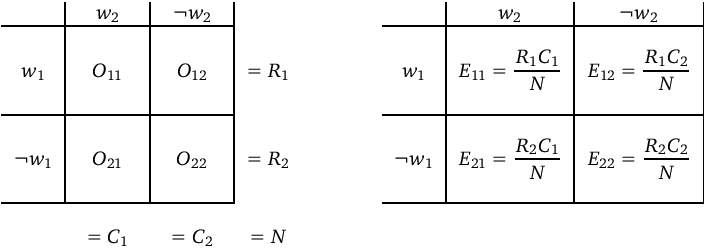

# Co-occurrence data & contingency tables

## Notation

Collocation analysis is based on the co-occurrence frequencies of word pairs, which are ranked according to some quantitative measure of their **statistical association**.  For each candidate word pair $(w_1, w_2)$, the relevant co-occurrence frequency data are collected in the form of a contingency table as shown in the left panel below.



$O_{11} = O$ represents the **co-occurrence frequency** of the two words, $R_1 = O_{11} + O_{12}$ is the **marginal frequency** of $w_1$ and $C_1 = O_{11} + O_{21}$ is the marginal frequency of $w_2$.  The **sample size** $N$ is obtained by adding up all four cells of the contingency table.

Statistical **association measures** (**AM**) compare the observed contingency table $O_{ij}$ with the **expected frequencies** $E_{ij}$ under the null hypothesis of no association between $w_1$ and $w_2$, i.e. assuming that the two words co-occur only by chance.  Statisticans often speak about the null hypothesis of **independence** of rows and columns, but it may be most intuitive to think of $E_{ij}$ as the contingency table expected for a randomly shuffled corpus.  Expected frequencies can be computed from the row and column marginals as shown in the right panel above.  Again, the most important value is the top left cell $E_{11} = E$, representing the **expected co-occurrence frequency** of $w_1$ and $w_2$.

## Contingency tables in R

For a collocation analysis, we will want to compute association scores for a large number of word pairs $(w_1, w_2)$, so it does not make sense to represent each table as a separate $2\times 2$ matrix.  It is much better to collect all contingency tables in a single large table (i.e. a `data.frame`), where each row corresponds to the full contingency table of one word pair.

Since an accurate computation of contingency tables (according to Evert 2004, 2008) can be rather tricky, it is often better to use specialized software tools (such as the [UCS toolkit](http://www.collocations.de/software.html)) for this purpose and load the resulting data table into R.  An exception are syntactic co-occurrences, which can be counted with relative ease based on a list of _pair tokens_.

The `SIGIL` package includes a co-occurrence table for bigrams of adjacent words in the Brown corpus.  Start by loading the package and reading the documentation for this data set with `?BrownBigrams`.

```{r}
library(SIGIL)
```

It is often instructive to look at the first few rows of a data frame.  You can also use `subset()` to pick out a few interesting words.

```{r}
subset(BrownBigrams, word1 == "learn")
```

> **Q:** What are the marginal frequencies of _learn_ and _about_? Can you specify the full contingency table for this word pair as a 2-by-2 matrix?

## Expected frequencies

As a first step, we need to compute a contingency table of expected frequencies for each word pair.  Let us pick out a small subset for practicing:

```{r}
BB <- subset(BrownBigrams, word1 == "learn")
```

In an R markdown document, you can print nicely formatted tables with the `knitr::kable()` function:

```{r}
knitr::kable(BB)
```

Expected frequencies are computed in terms of row and column marginals.  While it would be possible to spell out $E_{ij}$ directly in terms of the observed frequencies $O_{ij}$, it is easier and safer to compute the row and column totals first and add them to the table.  R's `transform()` function provides a convenient way to compute derived variables for all rows of a data frame.

```{r}
BB <- transform(BB, 
                R1 = O11 + O12, R2 = O21 + O22,
                C1 = O11 + O21, C2 = O12 + O22,
                N = O11 + O12 + O21 + O22)
knitr::kable(BB)
```

In the same way, we can now compute expected frequencies $E_{ij}$ using the equations shown at the top of the document.

```{r}
BB <- transform(BB,
                E11 = R1 * C1 / N, E12 = R1 * C2 / N,
                E21 = R2 * C1 / N, E22 = R2 * C2 / N)
knitr::kable(BB[, c(2:9, 15:18)], digits=2)
```

> **Q:** What does a comparison of `O11` and `E11` tell you about the collocational strength of these 5 bigrams?

# Association measures (AM)

## Simple association measures

Simple association measures are based on a direct comparison of observed co-occurrence frequency $O = O_{11}$ with the expected co-occurrence frequency $E = E_{11}$.  They do not take the other three cells of the contingency table into account.  A particular simple and intuitive AM is the ratio of observed and expected frequency.  Its logarithm corresponds to the information-theoretic concept of pointwise **Mutual Information**:
$$
\text{MI} = \log_2 \frac{O}{E}
$$

Another popular AM in computational lexicography is **t-score**, derived from a completely inappropriate application of Student's t-test (but let's not get into that).
$$
\text{t-score} = \frac{O - E}{\sqrt{O}}
$$

Let us add these two measures to our collocation table:

```{r}
BB <- transform(BB, 
                MI = log2(O11 / E11), 
                t.score = (O11 - E11) / sqrt(O11))
knitr::kable(BB[, c(2:6, 15, 19:20)], digits=2)
```

> **Q:** Look up the equations of other simple association measures in the lecture slides or on <www.collocations.de/AM> and add them to the data frame.  Do the association scores agree with your intuitive judgement of collocational strength?

## Statistical association measures

More sophisticated association measures make use of the full observed and expected contingency tables.  Many of these measures are derived from statistical hypothesis tests, e.g. the chi-squared test statistic $X^2$.
$$
X^2 = \sum_{ij} \frac{(O_{ij} - E_{ij})^2}{E_{ij}}
$$

Other AMs are based on the conditional probabilities $P(w_2 | w_1) \approx O_{11} / R_1$ and $P(w_1 | w_2) \approx O_{11} / C_1$.  A recent example is the directional measure $\Delta P$:
$$
\Delta P_{2|1} = \frac{O_{11}}{R_1} - \frac{O_{21}}{R_2}
$$

> **Q:** Add these assocation scores for these two measures to the data table. Find other interesting AMs in the lecture slides and add them to the data table.

# Collocation rankings

For a real collocation analysis, we have to annotate the full data table `BrownBigrams` with marginal frequencies, expected frequencies and association scores.  Note that this cannot be achieved with a single `transform()` command because intermediate results do not become available immediately.

```{r}
BB <- transform(BrownBigrams, 
                R1 = O11 + O12, R2 = O21 + O22,
                C1 = O11 + O21, C2 = O12 + O22,
                N = O11 + O12 + O21 + O22)
BB <- transform(BB,
                E11 = R1 * C1 / N, E12 = R1 * C2 / N,
                E21 = R2 * C1 / N, E22 = R2 * C2 / N)
BB <- transform(BB, 
                MI = log2(O11 / E11), 
                t.score = (O11 - E11) / sqrt(O11),
                X2 = (O11-E11)^2/E11 + (O12-E12)^2/E12 + (O21-E21)^2/E21 + (O22-E22)^2/E22,
                DP = O11 / R1 - O21 / R2)
BB2 <- BB[, c(2:6, 15, 19:22)] # just the relevant columns
```

In order to find the most strongly associated bigrams, we need to reorder the data frame `BB2` according to one of the association measures.  The `order()` function determines a suitable row index:

```{r}
idx <- order(BB2$MI, decreasing=TRUE)
idx10 <- idx[1:10] # top-10 collocations (according to MI)
knitr::kable(BB2[idx10, ], digits=2)
```

> **Q:** Compute top-10 or top-20 collocations for other association measures.  What do you notice about these lists?  Can you describe the differences between AMs?

We can make our life a lot easier by defining a helper function that reorders a data frame according to one of the columns. The function takes two arguments: the data frame to be reordered and the name of the column.  A third optional argument allows us to select a specified number of highest-ranked collocations.

```{r}
order.df <- function (x, name, n=Inf) {
  idx <- order(x[[name]], decreasing=TRUE)
  head(x[idx, ], n) # return first n rows
}
```

> **Q:** Can you add a fourth argument to the function that allows a choice between increasing and decreasing ordering?

A top-10 list can now easily be computed and printed with

```{r}
knitr::kable(order.df(BB2, "DP", n=10), digits=2)
```

In practical work, you will often want to apply various filters, e.g. to find the most strongly associated noun-noun pairs

```{r}
NN <- subset(BB2, pos1 == "N" & pos2 == "N")
knitr::kable(order.df(NN, "X2", n=10), digits=2)
```

or collocations of a particular node word

```{r}
time.x <- subset(BB2, word2 == "time")
knitr::kable(order.df(time.x, "X2", n=10), digits=2)
```

As a last example, let us take a look at strongly associated bigrams of two consecutive determiners.  In the Penn treebank tagset, this includes expressions such as _such a_ and _all the_.

```{r}
II <- subset(BB2, pos1 == "D" & pos2 == "D")
knitr::kable(order.df(II, "X2", n=10), digits=2)
```

> **Q:** Are there any surprising entries in the top-10 list? Can you make a guess what's going on?

# Keyword analysis

Keywords can be seen as a special case of collocation analysis.  Instead of presence or absence of $w_2$, the columns of the contingency table correspond to the two (sub-)corpora to be compared (see SIGIL Unit #2).  For example, a word $w$ that occurs $k_1$ times in a corpus of $n_1$ tokens and $k_2$ times in a second corpus of $n_2$ tokens would be represented by the contingency table
$$
\begin{array}{r|c|c|}
& \text{Corp 1} & \text{Corp 2} \\
\hline
w & k_1 & k_2 \\
\neg w & n_1 - k_1 & n_2 - k_2 \\
\hline
\end{array}
$$

We can apply the association measures introduced above to such contingency tables: the highest-ranked "collocations" resulting from this analysis are keywords for corpus 1.

The `SIGIL` package includes a table with frequencies of 60 nouns in the written and spoken part of the British National Corpus.  The last row of the table provides the cumulative frequency of all other nouns, which is required to determine the respective sample sizes.

```{r}
knitr::kable(head(BNCcomparison))
```

First, we need to compute the sample sizes of the written and spoken BNC by adding up all frequency counts in the respective column.  We take the spoken BNC as the first sample so we can find keywords of spoken language.  For technical reasons, the frequency counts must be converted to floating-point numbers first.

```{r}
BNCcomparison <- transform(BNCcomparison,
                           spoken = as.numeric(spoken), written=as.numeric(written))
n1 <- sum(BNCcomparison$spoken)
n2 <- sum(BNCcomparison$written)
```

Now construct a data frame with the full contingency tables as shown above.

```{r}
KW <- transform(BNCcomparison,
                O11 = spoken, O21 = n1 - spoken,
                O12 = written, O22 = n2 - written)
knitr::kable(tail(KW))
```

For simplicity, we will only apply simple AMs and compute the expected co-occurrence frequency directly using the equation $E_{11} = (O_{11} + O_{12}) * (O_{11} + O_{21}) / (n_1 + n_2)$.

```{r}
KW <- transform(KW, E11 = (O11 + O12) * (O11 + O21) / (n1 + n2))
```

Keywords according to the t-score measure:

```{r}
KW <- transform(KW, t.score = (O11 - E11) / sqrt(O11))
knitr::kable(order.df(KW, "t.score", 10), digits=2)
```

Keywords according to Mutual Information:

```{r}
KW <- transform(KW, MI = log2(O11 / E11))
knitr::kable(order.df(KW, "MI", 10), digits=2)
```

> **Q:** Find 10 "anti-keywords" with the lowest MI scores. Are they keywords of written language? Do you notice any problems?

> **Q:** Compute keywords based on other association measures. Then carry out a second keyword analysis for written against spoken analysis. How do you obtain suitable contingency tables for this second analysis?

